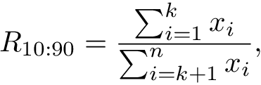

Inequality Coefficients:
========================

This is small library with some implemented coefficients (or indices)
intended to measure inequality or concentration of the values in a
population.

Implemented coefficients
-------------
* Gini Coefficient:
    * Ordinary. Follows this formula:
    
    
    
    * Corrected. Uses a correction for small datasets based on [Deltas,
2003](https://doi.org/10.1162/rest.2003.85.1.226).
* Ratio top / rest. Follows this formula:

    

Where k is is the ceil value for 100 - percentage you define.
For instance, if you take k = 10, you are getting the ratio of inequality between the top 10% percentage and the rest 90% percentage. In particular, this specific value of k is given to you directly by the `ratio_top10_rest()` function.

Installation
------------

This library is hosted on PyPI, so installation is straightforward. The
easiest way to install type this at the command line (Linux, Mac, or
Windows):

    pip install inequality_coefficients

This library also depends on numpy, but `pip` should take of that for
you already.

Basic Usage
-----------

For the simplest, typical use cases, this tells you everything you need
to know.:

    import inequality_coefficients as ineq
    data = array([1.7, 3.2 ...]) # data can be list of nums or numpy array
    gini_coeff = ineq.gini(data)
    ratio_top_rest = ineq.ratio_top10_rest(data)

# Development

To setup the development environment install all the dev dependiencies with `pip install -r requirements.txt` and install the latest version in your sites-packages with `python setup.py develop`.

## Run tests

I use pytest. Install it with `pip install -U pytest` and run the test with the development setup with `pytest`.

Acknowledgements
----------------

Firstly, I was based on Felipe Ortega's wikixray code for implementing the gini coefficient, however, my code has changed so much (I have even fixed a bug in his code) and also now I'm using numpy as backend.

Anyway, I want to thank him for open sourcing that project.
